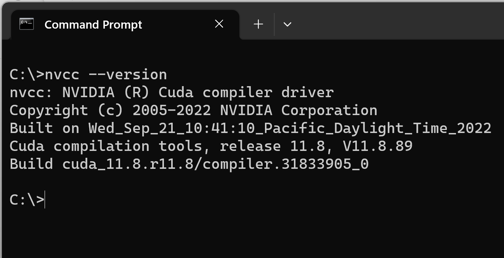

# Chat Researcher with WatsonX
Hello, everyone. The purpose of this notebook is to create a chatbot that reads papers online and answers technical questions from  Arxiv
You can download one of the best models of Generative AI that are free and open source.
or you can connect with your **WatsonX** account or **ChatGPT** account.
The idea of this program is to develop a simple tool that helps researchers find insights about issues that we have in science.
# Installation

## Step 1: Install Python
First, we need to install Python on our computer, in this demo I will use Python 3.10.11

https://www.python.org/ftp/python/3.10.11/python-3.10.11-amd64.exe

During the installation I should suggest add python.exe to PATH and install Now.
With Python already installed, you should have pip already installed. Be sure to use a pip that corresponds with Python 3 by using pip3 or checking your pip executable with pip –version.

## Step 2: Install CUDA 11.8
You can verify that you have a CUDA-capable GPU through the Display Adapters section in the Windows Device Manager

```
control /name Microsoft.DeviceManager
```

you can install cuda from this site, we will install the version 11.8.0
https://developer.nvidia.com/cuda-11-8-0-download-archive?target_os=Windows

In this project we will test different models, ones that can ran from local and online. 

```
nvcc --version
```



Then we need to install the Cuda Toolkit 11.8.0

https://developer.download.nvidia.com/compute/cuda/11.8.0/local_installers/cuda_11.8.0_522.06_windows.exe


## Step 3: Create a Python virtual environment
A Python virtual environment allows one to use different versions of Python as well as isolate dependencies between projects. If you’ve never had several repos on your machine at once, you may never have felt this need but it’s a good, Pythonic choice nonetheless. Future you will thank us both!

First we create a folder where we are going to build our project

```
cd \
mkdir ArxivChat

```
Run the following command:
```
python  -m venv .arxiv_environment
```

You’ll notice a new directory in your current working directory with the same name as your virtual environment.

Activate the virtual environment

In Windows you type

```

.arxiv_environment\Scripts\activate.bat

```


All other OSs: source

```
./.arxiv_environment/bin/activate

```
and we install the libraries neeeded for this project

First we update our pip
```
python.exe -m pip install --upgrade pip

```
then we install our libraries


we create the following requirements.txt file


```
#requirements.txt
ibm-watson-machine-learning>=1.0.312
PyMuPDF
tensorflow==2.9.2
tensorflow-hub==0.12.0
scikit-learn==1.0.2
gradio==3.37.0
ipykernel
notebook
openai
transformers
ipywidgets
torch --index-url https://download.pytorch.org/whl/cu118

```
and then we install
```
pip install -r requirements.txt
```

then can install 

```
python -m ipykernel install --user --name ArxivChat --display-name "Python (ArxivChat)"
```


#Troobleissues

If your computer says  Could not load dynamic library cudnn64_8.dll
go to you environment
`C:\ArxivChat\.arxiv_environment\Lib\site-packages\torch\lib `

and copy cudnn64_8.dll int the following folder

`C:\Program Files\NVIDIA GPU Computing Toolkit\CUDA\v11.8\bin`